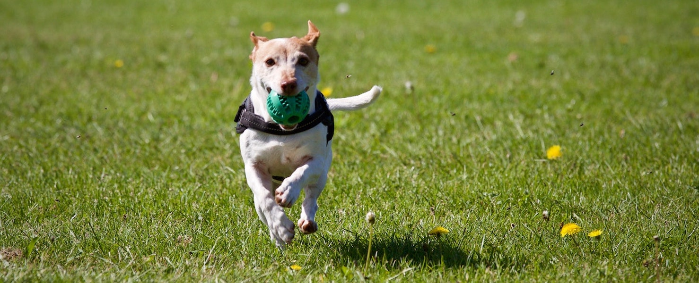

Ambiente
===================================

**Le aree verdi urbane sono una risorsa fondamentale per la sostenibilità e la qualità della vita in città, contribuendo a mitigare l’inquinamento e migliorare il benessere del cittadino.**

La principale sfida da affrontare in futuro per il territorio gioiese è trovare un equilibrio tra densità urbanistica e qualità della vita.
Gli spazi verdi sono aree urbane che permettono di migliorare sensibilmente il benessere e la salute del cittadino, sono luoghi di convivenza sociale condivisi che devono essere mantenuti e ampliati.

Il problema del traffico veicolare è una delle principali fonti di malattie croniche alle vie respiratorie, è necessario limitare notevolmente l’inquinamento prodotto insieme alle pericolose discariche abusive nelle campagne del territorio gioiese, spesso con rifiuti speciali e pericolosi come l’amianto, in aumento a causa del fenomeno fisiologico di abbandono rifiuti per la raccolta differenziata.

Sarà compito dell'Amministrazione attivare ogni forma di prevenzione e controllo al fine di reperire il più elevato standard qualitativo ambientale.

Air Quality
-------------
.. image:: ./_images/itea.jpg
  :width: 100%
  :alt: Partecipazione
  :align: center

**Impedire insediamenti che possano esercitare attività di sperimentazione industriale con potenziali rischi per la salute.**

Promuovere progetti di di monitoraggio ambientale degli inquinanti atmosferici della zona Industriale in collaborazione con `ARPA`_, ISPRA e Università per fornire alla città dati puntuali sull’inquinamento provenienti da centraline di monitoraggio installate nella zona industriale tramite `servizi web di report dei dati`_ accessibili in formato **open data**.

'''''''''''''''''''''''''''''''''''''''
Formazione
'''''''''''''''''''''''''''''''''''''''
Attività di sensibilizzazione ambientale insieme all’ARPA, e progetti di formazione in collaborazione con Associazioni insieme alle scuole per la rilevazione dei dati ambientali.

'''''''''''''''''''''''''''''''''''''''
Lotta alle discariche abusive
'''''''''''''''''''''''''''''''''''''''
Incremento dei controlli nelle campagne gioiesi del fenomeno delle discariche abusive con l’installazione di fototrappole.

Gioia del Colle città "Pet Friendly"
-------------------------------------

Il Comune di Gioia del Colle deve diventare pet friendly, spazi verdi vivibili per gli animali e per chi li ama, nel rispetto delle condivisione del senso civico che devono adottare i proprietari degli amici a 4 zampe.

Sarà necessario progettare nuovi spazi verdi attrezzati cercando di riqualificare zone altrimenti abbandonate al degrado. In questi spazi gli animali domestici, i cani in particolare, potranno giocare e socializzare tra loro. 

Tali aree verdi saranno controllate constantemente affinchè ogni proprietario comportamenti improntati al rispetto igienico sanitario.

La esistente area DOG sarà bonificata e ripulita. I proprietari che non rispettano l'obbligo di raccolta delle deiezioni canili, al contempo saranno sanzionati come per legge.

''''''''''''''''''''''''''''''''''''''''''''''''''''''''''''''''''''''''''''''
"Parco degli affetti" il `primo cimitero per Animali`_
''''''''''''''''''''''''''''''''''''''''''''''''''''''''''''''''''''''''''''''
Individuazione di un terreno pubblico da affidare in gestione ad un’associazione tramite bando pubblico per dare degna sepoltura ai propri animali domestici.

Canile Municipale
'''''''''''''''''''''''''''''''''''''''
Bisognerà completare la messa a norma del canile sanitario e ampliare le infrastrutture esistenti per fornire un servizio di adozione efficiente per la città.

Bonus "Cane"
'''''''''''''''''''''''''''''''''''''''
Con il "bonus cane" un gesto d’amore può trasformarsi anche in un buon investimento; si potrà prevedere un incentivo fiscale per chi deciderà di adottare un cane dal canile municipale.

Un albero per ogni nato
------------------------
Implementare il verde urbano piantando un albero per ogni nuovo nato e per ogni bambino adottato, applicando l’`obbligo previsto per legge`_.

.. _primo cimitero per Animali: http://www.tuttosuicimiteri.it/wp-content/files/Puglia_R.R._11_marzo_2015_n.8_Capo_V.pdf
.. _obbligo previsto per legge: http://www.gazzettaufficiale.it/eli/id/2013/02/01/13G00031/sg
.. _ARPA: http://www.arpa.puglia.it/web/guest/qaria
.. _servizi web di report dei dati: https://omniscope.me/internal/Pollution/TarantAir.iox/r/Report+ITA/#Inquinanti
