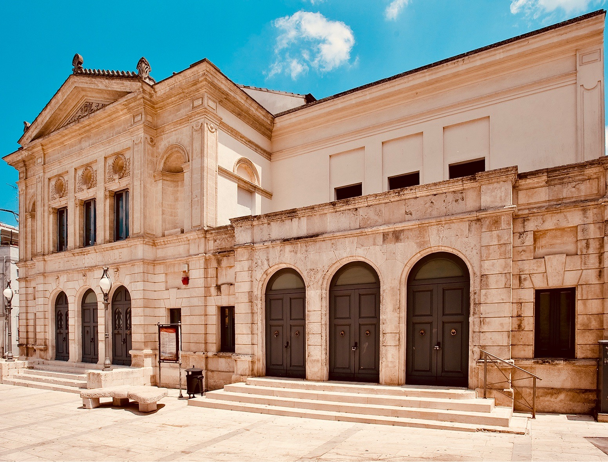

Cultura
============

----------------------------
Importanza e valorizzazione
----------------------------
La vera Conoscenza è quanto mai basilare all'interno delle moderne società e nei vari territori d'appartenenza; la storia e le tradizioni delle comunità in essa si riconoscono ed ad essa guardano al fine di migliorare le sensibilità di ognuno, il progresso e gli stili di vita.

La città di Gioia del Colle è antica e pregna di così molteplici tradizioni, usanze e costumi da farne potenzialmente un importante volano di crescita ed innovazione sociale.

Personalità illustri del passato, insigni uomini e donne di cultura contemporanei, vive ed interessanti intelligenze, operose Associazioni Culturali e di servizio hanno da sempre apportato alla nostra Città proposte ed iniziative sempre interessanti e degne di nota.
Gioia del Colle ha bisogno di un programma culturale e di promozione turistica nuovo ed innovativo; il lavoro che è stato portato avanti, è la sommatoria di varie anime che hanno collaborato insieme alla stesura con l'apporto di idee e proposte, ma anche redatto dopo un attento ascolto delle varie Associazioni Culturali e di numerosi singoli uomini e donne di cultura ed operatori culturali del territorio. Lo stesso, inoltre, è stato stilato nel solco della tradizione di Gioia del Colle e nel rispetto delle consuetudini, gusti, costumi, desideri, grado d'istruzione della popolazione, numero di Istituti Scolastici, consapevoli tutti che il vero Sapere è alla base di ogni piu' sana ed autentica Civiltà.

Il recupero della memoria del nostro passato, passerà anche attraverso il doveroso rispetto delle illustri personalità del passato che grande lustro hanno dato a Gioia del Colle intermini di famiglia, educazione e cultura. 

**Giovanni Carano-Donvito, Ricciotto Canuto, Francesco Romano, Enrico Castellaneta, Renato Javarone, Giuseppe Labrocca, Raffaele Van Westerhout, Cristoforo Finto, Paolo Cassano, Cesare Soria, Francesco Paolo Losapio, Donato d'Eramo, Dorotea Taranto- Minei, Fortunato Matarrese, Franco Galli, Alfredo Pagano, Cesare Svelto, Melina Procino, Costantino Colacicco, Mario Girardi, Luigi Tosco, Lina Eramo, Donato Boscia, Annetta Serino, Vincenzo Oliva, Fratelli Capurso, Armando Celiberti, Mimmo Castellano** , sono solo alcuni del *grandi* della nostra città il cui ricordo sarà doveroso rinverdire non solo al nostro paese, ma anche ai giovani studenti; 
la riscoperta delle gesta dei grandi sarà uno dei tanti obiettivi cui la Pubblica Amministrazione dovrà mirare, con il giusto rispetto nei confronti di tutto coloro i quali hanno reso alla città contributi notevoli nel campo della economia, della scienza, dell'insegnamento e dell'arte.

Il compito sarà esaltarne il ricordo indicando l'esempio e la laboriosità alle nuove generazioni per renderli consapevoli delle tracce di chi - prima di noi - ha seminato grandemente per donare al nostro Paese studio e fortuna.

Importante sarà anche scoprire ed esaltare le meravigliose architetture delle masserie e ville di campagna che numerose insistono nei dintorni dell'agro gioiese: **Masseria Gigante, Soria, San Pietro, Cassano, Rosati, Eramo, Ciavea, Surico, D'Onghia, Mandorlamara, Fatalone, Vallata, Colombo** andranno tutte indicate su apposite mappe illustrative all'interno delle quali verrà descritta la loro ubicazione e la loro storia.

Anche i Palazzi gentilizi delle famiglie gioiesi verranno adeguatamente esaltati, indicandone all'uopo epoche, costruttori, stili e proprietà: **Palazzo Surico, Cassano, Pagano, Romano, Monte, Jacobellis, Tateo, Nico, Pavove, Rizzi, Cirsella, Serino, Soria, Tateo, Carnevale, Capurso, Carano-Donvito, Tarsia-Incuria, Boscia ed Eramo**, tutti godranno di una nuova rinascita e giusta esaltazione. 

Il tutto senza dimenticare i tra importanti Conventi di Gioia del Colle: **Sant'Antonio, San Domenico e San Francesco**, insieme alla esaltazione degli slarghi e degli archi che numerosi insistono all'interno del nostro meraviglioso centro storico. 

Direttrice principe dell'Assessorato alla Cultura del Comune di Gioia del Colle, sarà comunque quella di indicare con puntualità e precisione le linee guida ispiratrici volta per volta di percorsi ed iniziative, in modo tale da tracciare solchi all'interno dei quali operare e mirare in vista del comune obiettivo di rendere la Città di Gioia del Colle eccellenza nel campo delle Arti, delle Lettere e delle Scienze.

------------------
Teatro "ROSSINI"
------------------

Organizzazione, Gestione e Direzione
--------------------------------------
Il **Teatro Comunale "Rossini"** preziosa ed insostituibile risorsa per la cultura gioiese, avrà la capacità di divenire pregiato contenitore per eventi e rappresentazioni teatrali di livello nazionale ed internazionale.
Grazie alla sua imponente costruzione storica che lo rende immobile di notevole rilevanza architettonica, il Teatro Comunale Rossini sarà destinato ad essere il centro pulsante di importanti iniziative, nonchè vera e propria fucina di produzione teatrale. .

Il Teatro Comunale Rossini, con il suo nuovo assetto organizzativo e direzionale infatti, si proporrà non solo come mero acquirente di spettacoli e/o pacchetti da proporre all'interno dei vari cartelloni di stagione, quanto piuttosto in grado di patrocinare e produrre imprese culturali in proprio, da essere destinate alla promozione, vendita e commercializzazione.
Al fine di perseguire tale obiettivo, sarà opportuna la istituzione di una vera e propria Scuola di Teatro in grado di formare "addetti ai lavori" i quali, in forza di proprie precipue competenze e specializzazioni acquisite, potranno realizzare, sempre per conto del Comune di Gioia del Colle, e per esso del Teatro Comunale, lavori e proposte culturali destinate alla commercializzazione e distribuzione, anche per il tramite di realizzazioni filmiche, sempre prodotte dal predetto Ente, dando priorità e supporto alle associazioni gioiesi già operanti sul territorio.

Per la organizzazione del Teatro Comunale Rossini, sarà opportuno individuare ed esaltare figure esperte per ricoprire ruoli al proprio interno i quali, individuati in base a precipue loro competenze, collaboreranno insieme alle Associazioni Culturali e di Servizio che faranno apposita istanza per partecipare alla gestione della nostra importante e consolidata realtà teatrale che è quella del "Rossini" di Gioia del Colle; all'uopo andranno adeguatamente coinvolte ed esaltate tutte le realtà e le competenze locali che con competenza ed esperienza, ma anche con spirito di servizio e di liberalità, si sono sempre occupate di cultura e di divulgazione della stessa.

Il Teatro Comunale Rossini, per il tramite dell'Assessore alla Cultura e delle Direzioni Artistica e Tecnica, andrà a collaborare ed interagire con le Scuole presenti nel nostro territorio, all'uopo organizzando appositi corsi didattici al loro interno, ma anche con le Associazioni Culturali e di Servizio, con la Consulta per la Cultura, con le Scuole nonchè con singole personalità che - dotate di particolare propensione per l'Arte e la Cultura- andranno ad essere individuate come interlocutori necessari per future forme di collaborazione.
Anche per il campo della musica sarà opportuno avvalersi di figure esperte nel suo campo le quali, in base a loro proprie precipue competenze, potranno coadiuvare con la Direzione del Teatro e con l'assessorato alla Cultura al fine di stilare una programmazione musicale adatta alla città ed ai suoi potenziali fruitori, all'uopo spaziando nei campo della musica sinfonica, operistica, leggera, da camera, popolare e jazz, e predisporre periodicamente proposte e cartelloni.

------------------------------------------------
Castello ed Area Archeologica di Monte Sannace 
------------------------------------------------

Utilizzo e Fruibilità
-----------------------
Al fine di una maggiore, piu' giusta ed opportuna fruibilità di tutti gli ambienti del Castello Normanno - Svevo di Gioia del Colle, nonchè dell'area relativa al sito Archeologico di Monte Sannace situato sulla S.P. Gioia - Turi, sarà necessario istituzionalizzare un formale accordo contrattuale tra Comune di Gioia del Colle (e per esso il Sindaco e l'Assessore alla Cultura pro - tempore) e la Direzione del Castello Normanno - Svevo; a tale accordo sarà opportuna la partecipazione di altri Enti necessari partner del protocollo: tra essi il Polo Museale, il Museo Archeologico Nazionale di Gioia del Colle, il MIBACT e la società Nova Apulia, la quale attualmente gestisce lo spazio di piano-terra destinato a bar, rivendita di libri e book shoop.

Il rapporto obbligatorio a stipularsi andrà a disciplinare con attenzione tempi, condizioni,. modalità ed eventuali costi per l'utilizzo da parte della Pubblica Amministrazione, non solo del Castello e dei suoi ambienti, ma anche del sito archeologico, offrendo la possibilità al nostro Comune di ivi organizzare eventi e proposte di altro livello culturale ed artistico.

Tale protocollo d'intesa avrà l'obiettivo, rendendo maggiormente fruibili le aree del maniero federiciano gioiese e di Monte Sannace, di attrarre un maggior flusso di turisti nella nostra Città, per il tramite di occasioni di aggregazioni di pubblico e di turisti. Confluendo in Gioia del Colle attratti da iniziative culturali di ampio respiro, e comunque in sintonia con quelle che sono le nostre tradizioni e la nostra storia, gli avventori potranno usufruire delle attività commerciali ivi esistenti, acquistando all'uopo prodotti tipici della nostra gastronomia e degustando menu' a tema presso i nostri ristoranti ed osterie, in tal modo muovendo economie e tipicità nostre squisitamente locali.

Nelle adiacenze dell'antico sito archeologico di **Monte Sannace**, si erge la Chiesetta dell'Annunziata, affidata alle cure della Parrocchia Santa Maria Maggiore di Gioia. 
E' tradizione che, nelle due domeniche successive alla Pasqua, dopo la celebrazione liturgica svolta al mattino, si svolge la tradizionale ed antica *Passata al Monte*; in tale occasione i fedeli effettuano tre giri intorno alla Chiesa, terminando il tutto con l' "affidamento" del "passato" alla Madonna; il tutto in segno di devozione e di intercessione. Sarà cura della Amministrazione esaltare questa suggestiva tradizione popolare organizzando celebrazioni di concerto con la Parrocchia.

Anche la festa del primo Maggio a Montursi in occasione della ricorrenza di San Giuseppe lavoratore sarà rivalutata ed adeguatamente esaltata di concerto con la locale Associazione e tutti gli abitanti della storica contrada dell'agro gioiese.

-------------------------
Consulta per la Cultura 
-------------------------

Finalità ed Istituzione
-------------------------

La Consulta Comunale della Cultura del Comune di Gioia del Colle, il cui regolamento è già in essere presso il Comune di Gioia del Colle, ma giammai reso operativo nella sua propria precipua organizzazione, deve perseguire al suo interno la promozione ed il coordinamento delle attività culturali locali in stretta collaborazione con Associazioni, Sodalizi e Scuole operanti nella nostra Comunità.
La Consulta inoltre avrà il compito di fare emergere le esigenze e i bisogni della cittadinanza e dei singoli in riferimento alla cultura; di stimolare e favorire tutte quelle iniziative in grado di potenziare le attività della cultura e dello spettacolo; di coordinare l’associazionismo culturale presente sul territorio esaminandone le problematiche e ricercando le più appropriate soluzioni alle stesse; di promuovere l’attività delle associazioni elaborando strategie comuni per la valorizzazione del patrimonio culturale, delle iniziative letterarie, scientifiche, teatrali e musicali programmate nel territorio comunale; calendarizzare gli eventi da svolgersi presso i contenitori culturali; pubblicizzare gli eventi culturali patrocinati dal Comune anche attraverso l'utilizzo di un apposito spazio all’interno del rinnovato sito istituzionale del Comune, promuovere attività di collaborazione tra le varie associazioni.

La Consulta per Cultura avrà l'obbligo di operare in stretta sinergia e collaborazione con l'Assessorato alla Cultura, il cui esponente ne farà parte di diritto, ed avrà la facoltà di partecipare a tutte le riunioni e comunque essere informato in merito alle decisioni ed iniziative intraprese.
Alla Consulta Comunale della Cultura, nel cui coordinamento deve essere coinvolta la locale "Pro Loco", quale Associazione Turistica espressamente riconosciuta dall'Ente Comunale, e per la cui attività di promozione turistica si auspica maggiore operatività, potranno divenire parti tutte le Associazioni Culturale e di Servizio presenti sul territorio che ne avranno palesato espressa adesione a seguito di formale invito da parte dell'Ufficio Cultura, avrà la stessa durata di quello amministrativo del Consiglio Comunale che l’ha istituita.

-------------------------
I Contenitori culturali 
-------------------------

Palazzo Serino, Palazzo Tateo, Palazzo S.Antonio, ex Distillerie
------------------------------------------------------------------
.. image:: ./_images/cassano.jpg
  :width: 100%
  :alt: ex Distilleria
  :align: center

Una integrale opera di ripensamento, riqualificazione e rimodulazione degli spazi e degli ambienti di proprietà comunale meriteranno anche gli immobili di proprietà della pubblica amministrazione, sempre nel rispetto della progettazione e delle delibere già allo stato esistenti.
Frutto di lasciti testamentari e di donazioni in favore del nostro Municipio da parte di Famiglie benemerite di Gioia del Colle, i Palazzi di proprietà del Comune di Gioia del Colle saranno oggetto di studio e di attenzione, nell'ottica non solo di un razionale utilizzo degli stessi, ma anche di una opera di ristrutturazione ed ammodernamento.

Cura della Amministrazione sarà altresi' individuare professionisti specializzati nel settore in grado di inviduare bandi regionali e/o europei atti a finanziare progetti, opere ed idee di rilevanza culturale, ma anche tesi alla ristrutturazione di immobili di proprietà pubblica, ivi elaborando progetti di utilità, crescita e progresso comune.

Ulteriore attività sarà quella tesa ad un utilizzo sociale dei grandi ambienti degli immobili posti su **via Paolo Cassano (ex LUM), di Palazzo S.Antonio e della ex Distilleria** su via Prov.le Gioia - Santeramo: per questi ultimi, considerata la vastità delle loro aree sarebbe opportuno, previa verifica dello stato di conservazione e manutenzione degli stessi, istituire una apposita commissione comunale finalizzata ad elaborare piani economici, finanziari e sociali in relazione al loro futuro ed immediato utilizzo in favore della Comunità. 

Auspicabile sarà il mantenimento e l'ammodernamento dell'attuale **Info Point** il quale assicurerà la presenza di personale comunale durante le ore lavorative,ma soprattutto nel corso dei mesi estivi in cui il flusso turistico è maggiore; il tutto con personale a reperirsi tra le varie Associazioni di Gioia del Colle che ne faranno apposita richiesta, e che potrebbero gestire il punto informativo fornendo informazioni su: turismo, luoghi d'interesse storico,culturale ed architettonico, bar, ristoranti, pizzerie, masserie, chiese, luoghi, monumenti, eventi e/o iniziative culturali, luoghi d'aggregazione e palazzi padronali.

----------------------------------------
Pittori locali, Musica, Arti figurative
----------------------------------------

Occasioni, Sistema, Promozione artistica
-----------------------------------------
La Città di Gioia del Colle ha la fortuna di annoverare al proprio interno una moltitudine di personalità particolarmente versatili nel campo delle lettere, della musica e delle arti figurative. Considerata tale ricchezza di intelligenze, sarà quantomai opportuno un coinvolgimento corale di tutti con l'obiettivo di rendere Gioia vera e propria "città della bellezza".

Perseguire l'abbellimento del centro storico attraverso la promozione di attività ed iniziative benemerite come "Le Porte dell'imperatore" ed in generale della parte piu' antica e suggestiva di Gioia, nonchè la creazione di un circuito artistico, magari in sinergia con altri Comuni limitrofi, destinato alla realizzazione ed organizzazione di appuntamenti e mostre periodiche. 

Opportuno sarà anche favorire un proficuo interscambio collaborativo con le nostre attività commerciali (bar, ristoranti, pizzerie); le stesse, di concerto con i musicisti e le band locali opportunamente censite e riunite insieme in un apposito Albo, ben potrebbero organizzare manifestazioni all'aperto favorendo in tal modo la realizzazione di cartelloni estivi per mostre e concerti con artisti gioiesi, all'uopo agevolati riguardo tributi per tasse di occupazione di suolo pubblico, proprio in virtu' della loro capacità organizzativa di eventi aperti alla fruizione pubblica.
Il coinvolgimento degli artisti locali sarà utile anche al fine di una piu' adeguta riqualificazione delle periferie attraverso la loro impronta artistica che potrebbe essere lasciata come segno tangibile della loro arte, in tal modo andando a donare tracce di cultura a zone notoriamente trascurate della nostra città.

Anche la locale nascente pinacoteca comunale ad ubicarsi presso l' immobile attualmente occupato dall'INPS, potrà accogliere non solo grandi mostre, ma anche personali di pittori e scultori locali, fungendo anche da laboratori aperti al pubblico per eventuali corsi o sperimentazioni artistiche.
L'Amministrazione, infine, non farà mancare il proprio supporto e patrocinio in favore del glorioso Concerto Bandistico della Città di Gioia del Colle, che tanta fama ha diffuso nel mondo per le sue celeberrime esecuzioni musicali, nonchè per la diffusione della cultura letteraria, anche attraverso la organizzazione in proprio di rassegne letterarie in sinergia con scrittori, scuole e Case Editrici.

