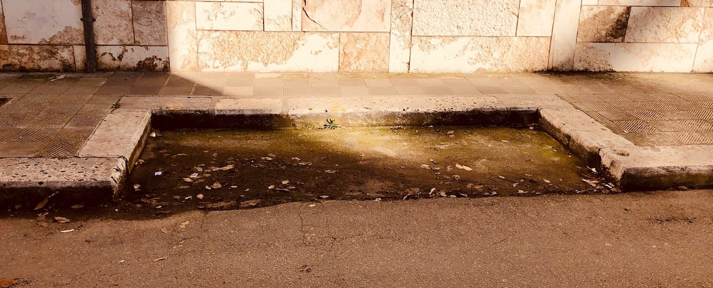

Mobilità sostenibile
===================================
**Il benessere del cittadino dipende in buona parte dal livello di mobilità sostenibile.**

Se esistono percorsi pedonali, piste ciclabili insieme ad un efficiente trasporto pubblico il cittadino abbandonerà i mezzi privati, queste tre variabili insieme contribuiscono ad avere mobilità sostenibile.

Purtroppo la cultura della mobilità sostenibile non è praticata, nonostante la presenza di importanti associazioni che promuovono la politica 
Il Comune di Gioia del Colle deve essere concretamente attivo nello sviluppo di una rete urbana di trasporto pubblico efficiente ed effettivamente funzionale alle esigenze dei cittadini.

Le azioni fino ad oggi effettuate sul territorio di Gioia del Colle, nonostante i buoni propositi delle ultime anni diretti ad organizzare incontri tematici, chiusure del traffico e con qualche finanziamento approvato, non hanno prodotto quel cambiamento culturale e sostanziale volto a ridurre la dipendenza dal traffico automobilistico individuale. 

Ciò è confermato dal netto incremento del Tasso di Motorizzazione presente in città dal 2002, ottenuto dal rapporto tra vetture circolanti ogni 1000 abitanti.

Riduzione del Traffico
-------------------------------

''''''''''''''''''''''''''''''''''''''''''''''''''''''''''''''''''''''''''''''
Potenziamento delle aree a sosta regolamentata
''''''''''''''''''''''''''''''''''''''''''''''''''''''''''''''''''''''''''''''
Potenziamento delle aree a sosta regolamentata, con disco orario, al fine di migliorare la rotazione degli stalli di sosta nel centro abitato e, contestualmente, favorire gli spostamenti con mezzi alternativi all’auto privata.

Gioia del Colle nodo strategico
---------------------------------
Gioia del Colle è in una posizione geografica strategica, crocevia di rete ferroviaria e stradale, in particolare per i tanti autobus che transitano nel tratto di Via Federico II di Svevia frequentato da tantissimi pendolari e studenti.

L’autobus è sempre stato un mezzo di trasporto per tutti, esistono servizi low cost flessibili e convenienti che soddisfano il passeggero e contribuiscono alla riduzione di CO2.

La fermata di Via Federico II di Svevia deve essere rigenerata affinché i viaggiatori possano essere accolti nella nostra città nel migliore dei modi e l'attesa dell'arrivo dei mezzi resa adeguatamente confortevole.

Stipulare accordi con tutte le agenzie di trasporto per creare nuove fermate extraurbane per le destinazioni nei paesi limitrofi e Bari, come ad esempio **Via dei Peuceti presso il Quartiere Rinascita, zona Colle delle Gioie**.

Barriere Architettoniche
--------------------------------------------------
Migliorare gli accessi ai marciapiedi da parte dei diversamente abili, effettuando una mappatura degli interventi e poi procedendo con gli adeguamenti, qualora sia possibile garantire uno spostamento in sicurezza.

Una città amica della bici
----------------------------
Dovrà esserci un impegno economico al fine di incentivare l'acquisto e l'utilizzo delle bici come mezzo quotidiano di locomozione.

''''''''''''''''''''''''''''''''''''''''''''''''''''''''''''''''''''''''''''''
Piano Urbano della Mobilità Sostenibile
''''''''''''''''''''''''''''''''''''''''''''''''''''''''''''''''''''''''''''''
Predisposizione ed adozione del `PUMS (Piano Urbano della Mobilità Sostenibile)`_, strumento indispensabile per programmare la mobilità cittadina nei prossimi 10 anni e per ottenere finanziamenti europei sulla mobilità.

'''''''''''''''''''''''''''''''''''''''
Piste ciclabili
'''''''''''''''''''''''''''''''''''''''
Sarà doveroso valutare la possibilità di installare percorsi ciclabili in sede fissa riducendo gli spazi di sosta delle vetture private o con rimodulazione del traffico viario. 
Tali percorsi dovranno tener conto della domanda da parte della cittadinanza, evitando gli errori del passato.

'''''''''''''''''''''''''''''''''''''''
Installazione di rastrelliere
'''''''''''''''''''''''''''''''''''''''
Si potranno creare spazi di deposito pubblici per la bicicletta e mezzi di micromobilità in prossimità di stazioni e di fermate degli autobus a medio/lunga percorrenza, al fine di garantire l’intermodalità.

Ad esempio il passaggio alla raccolta differenziata ha permesso di eliminare i cassonetti dei rifiuti lasciando alcuni spazi che potrebbero essere utili per il decoro urbano a favore della mobilità sostenibile.

Installare rastrelliere di ultima generazione in questi spazi vuoti per favorire l’uso di bici in città recuperebbe spazi che altrimenti resterebbero vuoti ed al contempo aumenterebbero la possibilità di raggiungere postazioni di arrivo/partenza con la bicicletta.

.. image:: ./_images/rastr_2.jpg
  :width: 100%
  :alt: Mobilita
  :align: center

.. image:: ./_images/rastr_3.jpg
  :width: 100%
  :alt: Mobilita
  :align: center

Il prossimo futuro
--------------------
L’auto elettrica è una chiave importante per una strategia ambientale, l'ecotassa inserita nella legge di Bilancio non può essere una soluzione per decarbonizzare dei trasporti perchè rappresenta una misura spot. 
L’Europa sta lavorando per creare le infrastrutture che rendano funzionale e sostenibile la mobilità su auto elettriche, così come le più grandi marche automobilistiche entro i prossimi due anni aumenteranno la produzione e la vendita di auto ibride e elettriche.

''''''''''''''''''''''''''''''''''''''''''''''''''''''''''''''''''''''''''''''
Realizzazione colonnine di ricarica per veicoli elettrici
''''''''''''''''''''''''''''''''''''''''''''''''''''''''''''''''''''''''''''''

Il Comune di Gioia del Colle sarà attivo a seguire le direttive e bandi europei per poter dotare il territorio di infrastrutture per la ricarica di auto elettriche. 

.. _App Moovit: https://moovitapp.zendesk.com
.. _PUMS (Piano Urbano della Mobilità Sostenibile): http://www.gazzettaufficiale.it/eli/id/2017/10/05/17A06675/sg
.. _E-Mobility Report del Politecnico di Milano: https://d1sjfc1jc23kt3.cloudfront.net/wp-content/uploads/2018/09/EMR_18_def.pdf