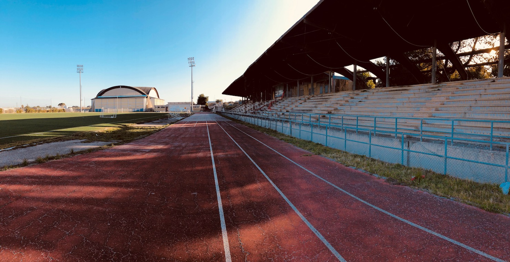
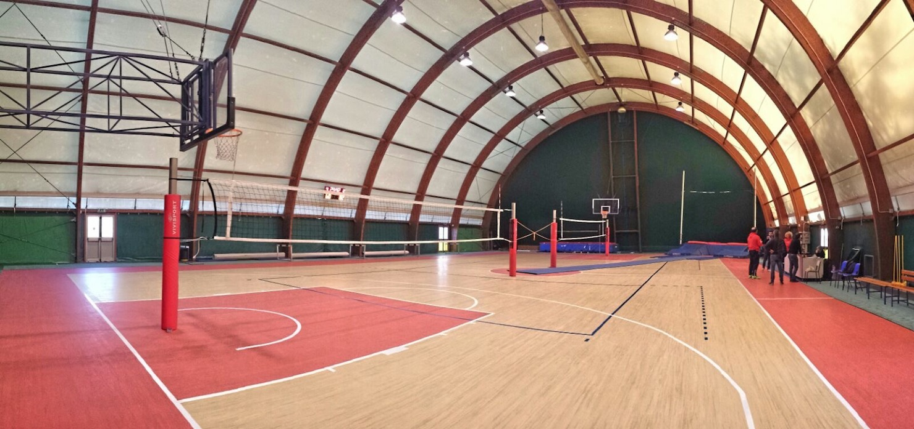
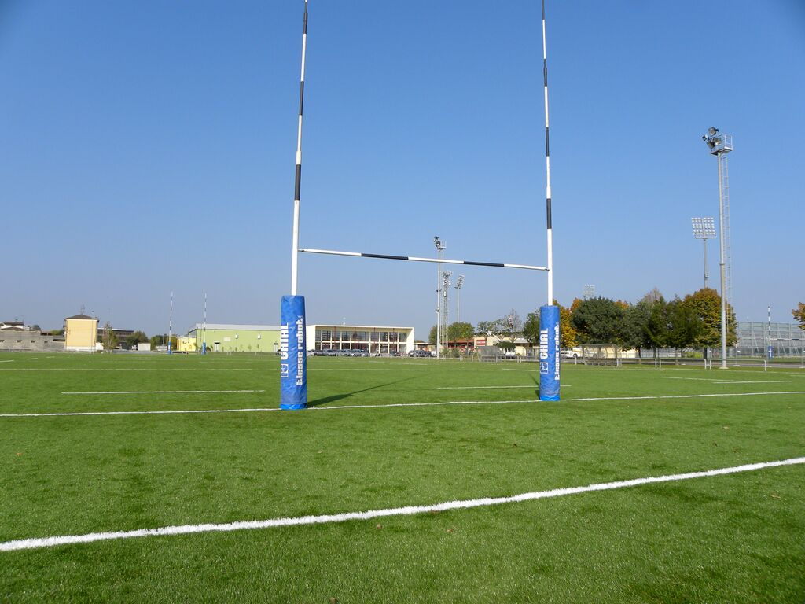

------
Sport
------
.. image:: ./_images/sport.jpg
  :width: 100%
  :alt: Partecipazione
  :align: center

**Lo sport è momento di educazione, socializzazione e cura.**
Lo sport è uno strumento per lo sviluppo completo e armonico della personalità dei nostri giovani, quindi del nostro futuro; le associazioni e società sportive hanno un ruolo fondamentale in questo percorso di crescita, saranno il nostro punto di riferimento per tutte le nostre politiche di diffusione della pratica sportiva.

L'importanza dell'attività motoria e sportiva non è riconducibile al solo benessere fisico, ma essa assume una fondamentale funzione di carattere culturale, sociale e formativa nonchè strumento di integrazione.
Dobbiamo assicurare lo **SPORT A TUTTI** e, ancor di più, ai ragazzi le cui famiglie non possono economicamente sostenere la relativa spesa.

**Fare sport sarà un diritto assicurato a tutti i ragazzi.**

La pessima politica di gestione e la manutenzione degli impianti sportivi negli ultimi anni, ha creato una situazione di disagio e seri problemi senza precedenti per tutte le società sportive.

Alcune discipline sportive sono state addiritture costrette a trasferirsi in altre città per poter disputare le gare e allenamenti del proprio campionato agonistico. 

E' necessario riportare ad un **livello base** di efficienza gli impianti, affinchè le società e associazioni sportive gioiesi possano ritornare a svolgere le loro attività nella nostra città.

Sarà necessario pianificare una attenta politica volta all'incremento della pratica sportiva attraverso:

1. Una corretta pianificazione di interventi strutturali ordinari e straordinari mediante il ricorso alle molteplici fonti di finanziamento pubbliche e private;
2. Incentivare e collaborare alla realizzazione di manifestazioni sportive costituenti un momento importante di diffusione delle discipline sportive oltre che momento di promozione turistico commerciale;
3. Razionalizzare le tariffe per l'uso delle strutture col compito precipuo di allargare soprattutto alle categorie di cittadini che versano in difficoltà economioche e sociali;
4. Utilizzare lo sport quale strumento attivo di prevenzione socio-sanitaria e di crescita relazionale e culturale;
5. Promuovere lo sport all'interno delle scuole consentendo l'utilizzo delle strutture durante le ore scolastiche;
6. Coordinare e promuovere la cooperazione delle associazioni/società sportive presenti sul territorio al fine armonizzare ed equilibrare i principali filoni dello sport giovanile, sport per tutti e sport di alto livello;
7. Garantire l'adeguata rappresentanza ed il confronto continuo alle società sportive al fine di rendere partecipi dei procedimenti decisionali gli operatori;
8. Attivare collaborazioni con il mondo imprenditoriale per lo sviluppo degli impianti sportivi, il loro utilizzo in ambito pubblicitario nonchè per la promozione di spettacoli.
9. Consentire alle società sportive il pieno utilizzo e l'accesso alle strutture sportive nelle ore prestabilite, prevedendo altresì l'individuazine di un responsabile per ciascuna di essa che possa anche garantire l'accesso in caso di necessità e/o impossibilità della ditta che gli garantisce il servizio.
10. Garantire la fruizione giornaliera della pista di atletica del campo Martucci per svolgere liberamente le attività di Running, sottoscrivendo apposito protocollo d'intesa con le locali associazioni di running;
11. Promuovere una collaborazione delle società sportive che svolgono la medesima attività al fine di creare un vivaio giovanile idoneo a consentire la crescita agonistica senza lasciare il territorio, riconoscendo adeguate premialità a chi opererà in questa direzione.

PalaKuznetzov
------------------------------------------------
Il Palazzetto PalaKuznetzov ha una pavimentazione omologata solo per il Volley, sarà necessario, attivandosi con immediatezza per la ricerca di fondi necessari, cambiarla con una superficie multifunzionale, adatta anche per altre discipline sportive.
**Impegno economico importante ma non più rimandabile.**

Partenariato Pubblico-Privato
-------------------------------
Attivare un percorso per arrivare a un partenariato pubblico-privato per la riqualificazione degli impianti sportivi.

'''''''''''''''''''''''''''''''''''''''
Modello ESCo
'''''''''''''''''''''''''''''''''''''''
Valutare la sperimentazione del `modello di business ESCo`_ che permette di realizzare l’intervento [#2]_ assumendo tutti i rischi e costi dell'opera al privato e liberando il Comune da ogni onere organizzativo, finanziario e gestionale. 
Condividere il risparmio con il privato che otterrà un beneficio economico per tutta la durata del contratto in misura proporzionale al risparmio conseguito.

Organizzazione degli spazi 
-----------------------------
La distribuzione attuale delle ore d'utilizzo degli impianti sarà ridimensionata e calibrata considerando altri criteri più ristrettivi di quelli in vigore con l'attuale regolamento. 
L'obiettivo sarà quello di stimare con più precisione l'effettivo uso di ogni impianto, affinchè si possano ottimizzare i costi di gestione. 
I criteri di merito delle associazioni devono tener conto principalmente dei seguenti parametri:

- l'anzianità di affiliazione al `CONI`_;
- il numero di atleti tesserati praticanti e agonistici secondo il `Registro delle Associazioni sportive`_;
- il numero effettivo di atleti praticanti per ogni società sportiva;
- esenzione del pagamento per ragazzi socialmente svantaggiati e progetti di integrazione sociale;

'''''''''''''''''''''''''''''''''''''''
Gestione degli impianti 
'''''''''''''''''''''''''''''''''''''''
Il contratto attuale per la pulizia e gestione degli impianti sportivi non è sufficiente a soddisfare le esigenze delle società sportive, dovrà essere revisionato considerando il numero di ore effettive di utilizzo degli impianti rispetto alla reale esigenza delle associazioni sportive

'''''''''''''''''''''''''''''''''''''''
Ufficio Sport
'''''''''''''''''''''''''''''''''''''''
L'ufficio Sport sarà riorganizzato in un nuovo organigramma di servizi comunali, affinchè possa gestire gli spazi con maggiore efficienza.

Nuove strutture sportive
--------------------------
Avviare processi di collaborazione e dialogo con la Regione Puglie e CONI per reperire finanziamenti destinati alla rigenerazione e all'utilizzo multidisciplinare delle strutture esistenti.

.. [#1] Legge 27 dicembre 1997, n. 449 (http://www.gazzettaufficiale.it/eli/id/1998/01/28/098A0239/sg) art.43, comma 1, ha previsto la possibilità per le Amministrazioni Pubbliche di stipulare contratti di sponsorizzazione, "al fine di favorire l'innovazione dell'organizzazione amministrativa e di realizzare maggiori economie, nonché una migliore qualità dei servizi prestati (...) - Con riferimento agli Enti locali, l' art. 119 del D.Lgs. 18 agosto 200, n. 267 dispone: «In applicazione dell'articolo 43 della legge 27 dicembre 1997 n. 449, al fine di favorire una migliore qualità dei servizi prestati, i comuni, le province e gli altri enti locali indicati nel presente testo unico, possono stipulare contratti di sponsorizzazione ed accordi di collaborazione, nonché convenzioni con soggetti pubblici o privati diretti a fornire consulenze o servizi aggiuntivi».
.. [#2] Es. Luci a Led nel Palazzetto per l'abbattimento dei costi di gestione

.. _CONI: https://www.coni.it
.. _Registro delle Associazioni sportive: https://www.coni.it/it/registro-societa-sportive.html
.. _modello di business ESCo: https://www.qualenergia.it/articoli/20140930-i-modelli-di-business-per-efficienza-energetica/