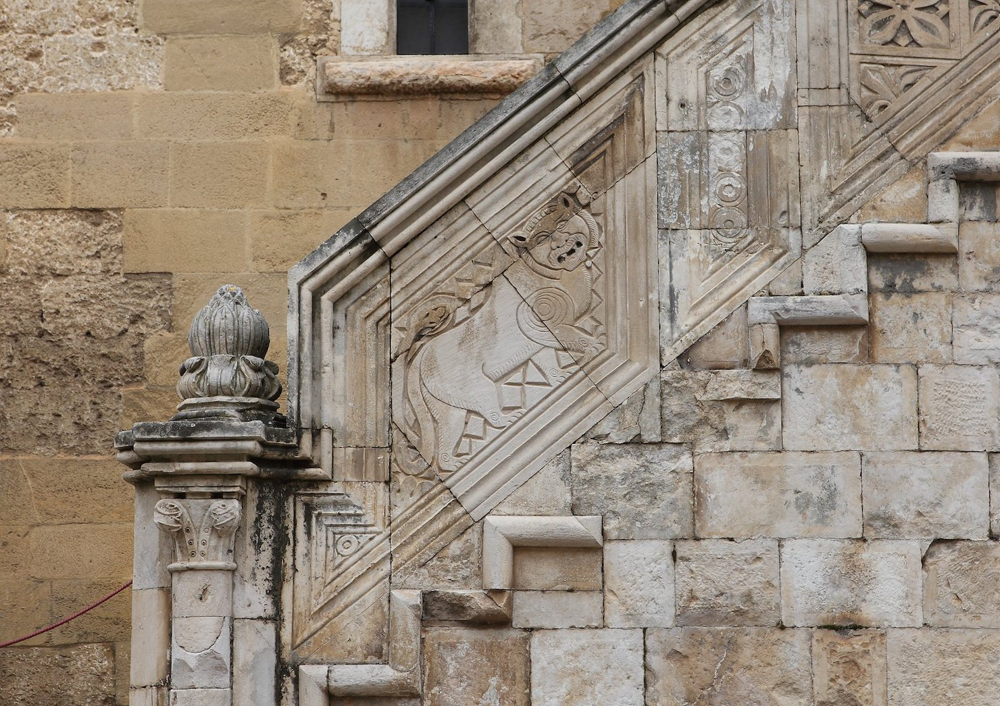
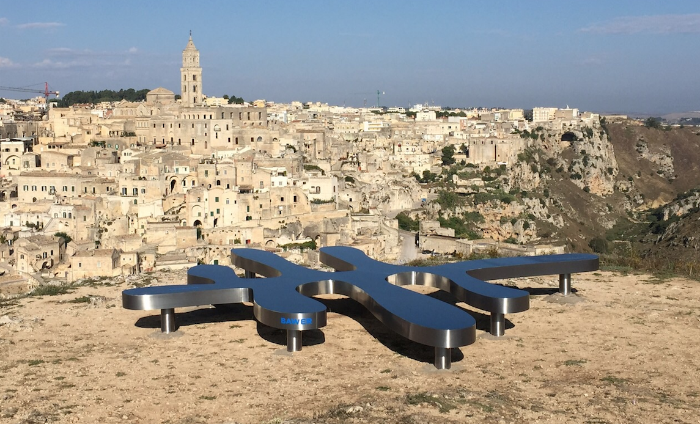

Turismo
=================

**Per ottenere sviluppo dal Turismo e Cultura è necessaria ricerca, innovazione e soprattutto infrastrutture, con una giusta strategia di marketing territoriale.**

La cultura e il turismo generano sviluppo solo con operatori dal profilo idoneo con una formazione in grado di aumentare il potere di attrazione del territorio con prodotti turistici mirati e una strategia comune.

Il Comune di Gioia del Colle svilupperà un **Piano Strategico** per una politica di marketing territoriale partecipata ed efficace con scelte strategiche che valorizzano l’identità del territorio, da adeguare al mercato turistico in materia di economia del turismo e cultura, in sinergia compatibile con i comuni limitrofi.

--------------------------------------
Occasioni di interesse e di curiosità
--------------------------------------

Anche la vocazione turistica del Comune di Gioia sarà opportunamente valorizzata da parte della Amministrazione Comunale, esaltando all'uopo realtà come Masserie, percorsi cicloturistici, Castello, Chiese, Monte Sannace, Montursi, Palazzi Padronali d'epoca.
Anche per quanto concerne la realtà tuttora in essere di ** `Matera 2019`_ - Capitale Europea per la Cultura - ** la stessa è, anche al momento, al centro dell'interesse della futura Amministrazione la quale già sin d'ora è al lavoro per la istituzione di un vero e proprio presidio all'interno della Città di Matera in modo tale da offrire a Gioia del Colle una vetrina privilegiata per pubblicizzare le proprie realtà turistiche e culturali di rilievo.

Rilevanti percorsi dell' Agro Gioiese come i luoghi del Sergente Romano, Masseria Vallata Lebbrosario, Monte Sannace, Santuario Madonna della Scala - Via per Noci, Zona ospitante i monumenti della Archeologia Industriale (via per Santeramo) saranno oggetto di studio da parte di una apposita commissione di esperti al fine di stilare un progetto di viabilità naturalistica e monumentale finalizzato ad una maggiore riscoperta dei luoghi piu' belli e suggestivi del nostro agro.
Turismo significherà anche attenzione alle strutture alberghiere, i B&B, Bar, Trattorie e Ristoranti- Pizzerie le quali tutte andranno rifornite di materiale pubblicitario e nuove guide (mappe) per meglio orientare il turista e veicolarlo nelle scelte e negli acquisti e per meglio orientarsi all'interno del nostro territorio.

Saranno promosse altresì visite organizzate presso Caseifici, Oleifici e Cantine di Gioia del Colle, al fine di esaltare ancora maggiormente le attività e le eccellenze della Eno-Gastronomia locale. La festa patronale di San Filippo del 26 Maggio, verrà poi considerata come patrimonio dell'Amministrazione Comunale la quale, di concerto con il Comitato Feste Patronali e la Chiesa Matrice di Gioia del Colle, farà in modo di pubblicizzare adeguatamente l'evento in modo tale da far confluire a Gioia del Colle un numero sempre maggiore di visitatori: una festa patronale riempita di cultura, storia e tradizione capace di donare a Gioia del Colle la notorietà che merita anche in termini di accoglienza e calore umano.
La cultura si sviluppa e si accresce anche attraverso la organizzazione di grandi manifestazioni di aggregazione popolare , quantomai opportune per offrire alla Città svago, distrazione ma anche conoscenza. A tal proposito sarà utile riprendere la nostra tradizionale "Festa della Mozzarella" la quale, adeguatamente ripensata nel suo stile e nella sua modalità organizzativa, andrà non solo a rappresentare la esaltazione e pubblicizzazione del nostro prodotto gastronomico "tipico", ma anche un momento di festa per tutta la città.

--------------------------------------------------------
Piano Strategico partecipato per lo sviluppo turistico
--------------------------------------------------------
Il Piano Partecipato per lo sviluppo turistico avrà l’obiettivo di creare e sviluppare la progettualità e l’operatività per il settore turistico del territorio.
Il Piano sarà co-progettato insieme a Stakeholders, Associazioni culturali, Pro Loco, operatori turistici e amministratori per raccogliere idee che metteranno al centro il turista, affinchè Gioia del Colle diventi una meta di vacanza competitiva e riconosciuta dal mercato.
Il territorio dell'Area di Gioia del Colle con i suoi patrimoni storici può attivare un potenziale inespresso, definendo strategie e proposte operative per un processo di crescita delle competenze e dei servizi digitali, al fine di creare sinergie tra gli attori pubblici e privati della filiera turistica, culturale e territoriale.

In Rete con Comuni limitrofi
-----------------------------
Co-progettare Piani strategici insieme a comuni limitrofi maggiori attrattori turistici rispetto a Gioia del Colle, come ad esempio Castellana Grotte con i suoi oltre 300.000 visitatori per le sue famose Grotte di straordinaria bellezza, che da oltre 50 anni attira visitatori da tutto il mondo.
Ampliare l'offerta turistica in *sinergia* con comuni a forte vocazione turistica mediante la fruizione di informazioni tramite tecnologie informatiche, capaci di realizzare un percorso virtuale tra le bellezze della Regione e il Comune di Gioia del Colle, in modo tale da formulare una proposta turistica integrata capace di interessare un numero sempre crescente di viaggiatori, con conseguenti benefici effetti sull’economia di settore. 

Innovazione e Comunicazione
-----------------------------
Scoprire il territorio ed il suo patrimonio culturale attraverso l’innovazione tecnologica che possa permettere di interagire con communities, favorendo il processo di internazionalizzazione e migliorando la capacità di attrazione degli investimenti pubblici e privati.
Sviluppare una piattaforma unica di servizi digitali che consenta di attivare una comunicazione diretta di carattere turistico-culturale, per dar vita ad una nuova dimensione del rapporto fra Città e viaggiatori per abbattere il gap comunicativo tra capacità di accoglienza del territorio ed i suoi visitatori. 
Una comunicazione puntuale circa: *ricettività, itinerari storici, artistici, culturali ed enogastronomici, gli eventi in programmazione*, per apprezzare e conoscere il meglio del nostro Territorio, soddisfando tutte le necessità del visitatore. 

^^^^^^^^^^
BIG DATA
^^^^^^^^^^
Capacità di comunicare ed innovare, utilizzando i **Big Data** a supporto delle decisioni strategiche nel turismo della citta’. 
Analizzare la percezione che hanno i turisti che passano da Gioia del Colle per creare le condizioni di attrattivita’, investendo nel capitale umano che si traduce in economia. 
I dati serviranno a scegliere quelle azioni che hanno il maggior impatto economico e finanziario senza stravolgere le abitudini e tradizioni locali, perche’ il territorio e’ il primo attore e motore del turismo.

.. _Fondazione ITS Turismo e Cultura: http://www.itsturismopuglia.gov.it
.. _Matera 2019 : https://www.matera-basilicata2019.it/it/