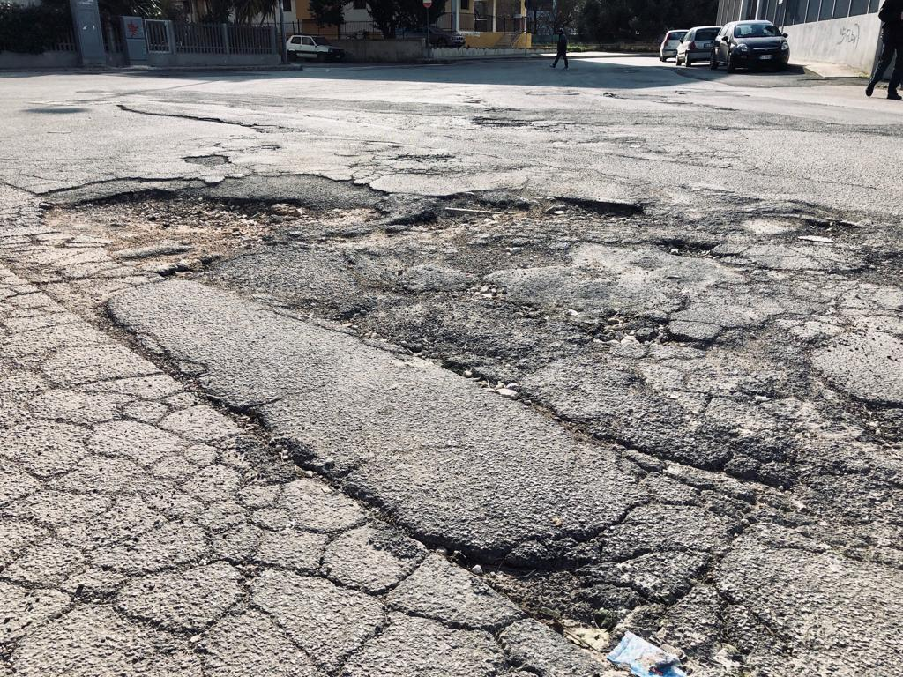
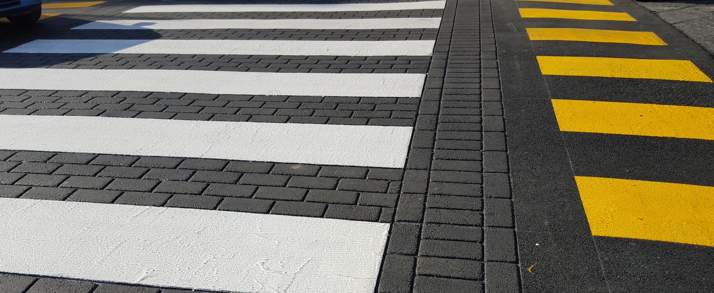
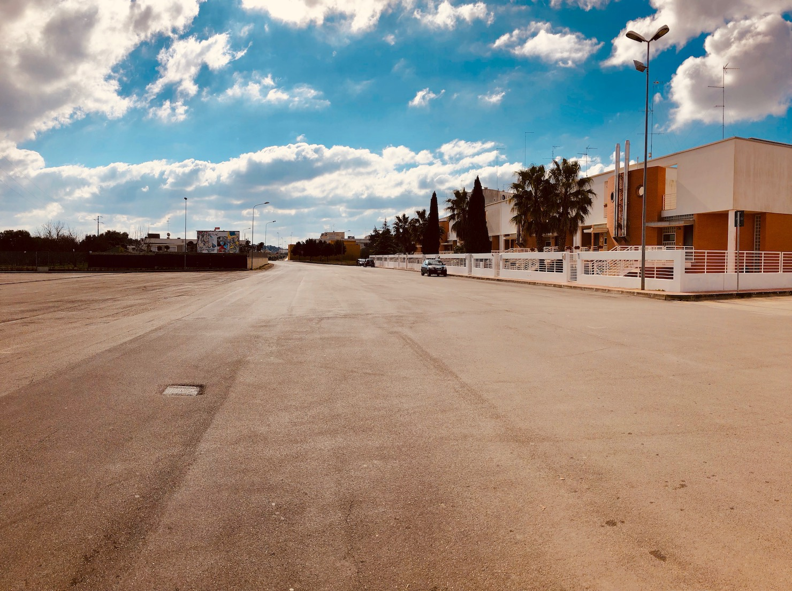

Urbanistica
===================================
L'attività urbanistica deve essere improntata alla riduzione del consumo del suolo e contemporaneamenete correlata all'implementazione dei servizi da offrire ai cittadini.

Gli interventi in materia urbanistica devono sempre garantire il miglioramento della qualità urbana.

La pubblica amministrazione e gli attori economici dovranno uniformarsi al principio della perequazione nella pianificazione urbanistica contemperando le rispettive esigenze al fine di raggiungere un modello di sviluppo che abbia come obiettivo il recupero e riuso delle aree dismesse, la riqualificazione di aree degradate nel rispetto dell'ambiente urbano.

Obiettivo primario deve indirizzarsi al completamento del **PUG (Piano Urbanistico Generale)** al fine di garantire un'approcio moderno per lo sviluppo del territorio nei prossimi anni.
Nelle more dell'approvazione sarà istituito un ufficio in grado di promuovere una collaborazione tra pubblico e privato nell'ambito di progetti di rigenerazione urbana.

Compito dell'Amministrazione sarà quello di attivare procedure che le norme nazionali e regionali consentono di utilizzare per la risoluzione di problemi urbanistici e per lo sviluppo delle aree produttive della città.

**Promuovere accordi di programma al fine di utilizzare strumenti perequativi per la realizzazione di nuovi standard urbanistici** per affrontare i problemi relativi alle aree commerciali e artigianali.

Adeguamento del Regolamento Edilizio Comunale al **RET (Regolamento Edilizio Tipo)** della Regione Puglia al fine di garantire una corretta e puntuale applicazione della normativa edilizia, eliminando dubbi e interpretazioni discrezionali.

Centro storico
--------------------
Il Centro Storico deve rappresentare l'anima e l'identità urbanistica della nostra città. 
Per ridare bellezza e autenticità, nel rispetto delle origini urbanistiche del centro storico, sarà obiettivo primario l'approvazione del **Regolamento Comunale Piano Colori e Materiali**.
Tale regolamento avrà come obiettivo quello di uniformare ed armonizzare tutti gli interventi di riqualificazione aventi ad oggetto edifici ricadenti nella zona storica.
Utilizzo ed impiego dei manufatti presenti nel centro storico rimaranno a destinazione libera evitando qualsivoglia inutile adempimento burocratico al fine di incentivare interventi ed insediamenti commerciali.

Con riferimento agli immobili realizzati antecedentemente all’entrata in vigore della `legge urbanistica n. 1150`_ del 17/08/1942 s.m.i. e ricadenti nelle zone residenziali così come definite dall’art. 8 delle NTA vigenti si precisa che per essi non si configura il cambio di destinazione d’uso ogni qual volta gli stessi vengano utilizzati per attività compatibili con le zone residenziali. 
In tal caso si configura solo una variazione di uso dell’unità immobiliare da regolarizzare mediante denuncia all’agenzia del territorio e comunicazione all’Amministrazione Comunale.

Al fine di valorizzare e recuperare le strutture ubicate nel Centro Storico "A/1" e nella zona di rispetto al Centro Storico "A/2" nonché gli edifici di vecchia costruzione antecedenti l’1.8.1942 (d’ora in avanti queste zone sono identificate come "zone in deroga"), è consentito l’utilizzo degli stessi a destinazione artigianale e/o attività commerciale e/o botteghe artigiane (con divieto di svolgimento delle seguenti attività di vendita: autoveicoli nuovi ed usati, materiali per l’edilizia, macchine ed attrezzature per l’industria e l’artigianato, macchine ed attrezzature per l’agricoltura e zootecnia, pneumatici, materiale da costruzione e legname).

Patrimonio edilizio rurale
----------------------------
Con riferimento alle **linee guida 4.4.6 del PPTR** (`Linee guida per il recupero e riuso`_ dell'edilizia dei beni rurali), si intendono per patriomonio edilizio rurale i manufatti aventi qualunque destinazione, edificati prima della riforma agraria e fondiaria in Puglia, **e in ogni caso realizzati prima del 1967**.

Tali immobili saranno considerati a destinazione libera e pertanto il loro riuso anche da parte di soggetti non imprenditori agricoli a titolo principale, non sarà soggetto ad oneri connessi con il cambio di destinazione d'uso proposto nel progetto di recupero, di ristrutturazione e di riuso.

A tal propostito si precisa che, entro il rispetto del `PPTR`_ e delle norme del presente regolamento in fabbriocati in  zona rurale, per essi non si configurerà un cambio di destinazione d'uso, ma solo una variazione d'uso dell'unità immobiliare, da regolarizzare mediante denuncia all'Agenzia del Territorio. 

Ufficio Tecnico efficiente
-----------------------------
Negli ultimi anni gli uffici comunali hanno subito troppi avvicendamenti di personale che hanno compromesso l'efficienza degli stessi. 

L'amministrazione dovrà avvalersi delle migliori competenze sul mercato a cui affidare la responsabilità dell'Ufficio Tecnico. 

Problematica COOP 
---------------------
Con riferimento al problema COOP bisognerà individuare nell'ambito del personale tecnico del Comune, la figura di un soggetto che faccia da interlocutore costante con la Regione Puglia per accellerare e concludere tutti gli adempimenti necessari al completamento della procedura in essere.
Compito dell'Amministrazione sarà quello di assegnare assoluta priorità alla risoluzione del problema ancora oggi irrisolto.

Viabilità
-------------------

''''''''''''''''''''''''''''''''''''''''''''''''''''''''''''''''''''''''''''''
"Piano Marshall" per la manutenzione delle strade
''''''''''''''''''''''''''''''''''''''''''''''''''''''''''''''''''''''''''''''
**Piano Marshall per la manutenzione stradale**, cronoprogramma delle priorità di interventi mirati a garantire sicurezza stradale e decoro urbano. 
Una buona parte delle somme ricavate dal recupero dei tributi locali evasi deve essere impiegata per la manutenzione stradale, diventata ormai un emergenza inprorogabile. 

Controllo di interventi di sui tratti urbani da parte di società esterne (Enel, AQP, Società telefoniche, ecc.) che spesso concorrono al degrado della viabilità stradale. 
Per tanto sarà necessario acquisire una preventiva comunicazione degli interventi che le società eseguiranno sul territorio, al fine di pianificare con puntualità e senza dispendio di risorse gli interventi di manutenzione.
Al termine dei lavori suddetti saranno eseguiti controlli rigorosi sugli interventi e qualità dei materiali impiegati nel rifacimento della strade.

'''''''''''''''''''''''''''''''''''''''
Sicurezza
'''''''''''''''''''''''''''''''''''''''
La messa in sicurezza di tratti urbani sensibili e ad alta frequentazione (Centri sportivi, scuole, ecc.) saranno oggetto di intervento attraverso l'utilizzo di dissuasori, rallentatori e nuove rotatorie.

Cittadinanza attiva e gestione degli spazi comuni
---------------------------------------------------
L'amministrazione dovrà porsi come obiettivo da raggiungere quello di sensibilizzare la cittadinanza alla cura degli spazi pubblici.
Bisognerà promuovere e sollecitare i privati (aziende, scuole, residenti, cittadini) ad adottare un luogo di uso comune (rotatorie, giardini, aree verdi, ecc.); sarà così possibile efficentare la manutenzione, abbellire urbanisticamente la città e al contempo diffondere la cultura del bene comune e/o semplicemente consentire uno spazio pubblicitario alle imprese.

Sarà promossa una campagna sui social network e attraverso le pagine istituzionali al fine di promuovere la collaborazione tra privati e pubblico. 
Permetterà ai soggetti privati di compiere erogazioni libere nei confronti del Comune, superando i limiti del `Regolamento sui Beni Comuni`_ con una donazione, sponsorizzazione, o altre forme di collaborazione contro il degrado urbano.

.. _Regolamento sui Beni Comuni: http://www.comune.gioiadelcolle.ba.it/cms/files/c0b3f884-3f80-4495-9c06-691639a435c2
.. _Linee guida per il recupero e riuso: http://paesaggio.regione.puglia.it/PPTR_2013_07/4._Lo%20scenario%20strategico/4.4_Linee%20guida/4.4.6_Manufatti%20rurali.pdf
.. _PPTR: https://www.paesaggiopuglia.it/pptr/tutti-gli-elaborati-del-pptr/4-lo-scenario-strategico.html
.. _legge urbanistica n. 1150: http://www.legislazionetecnica.it/52228/fonte/l-17-08-1942-n-1150
